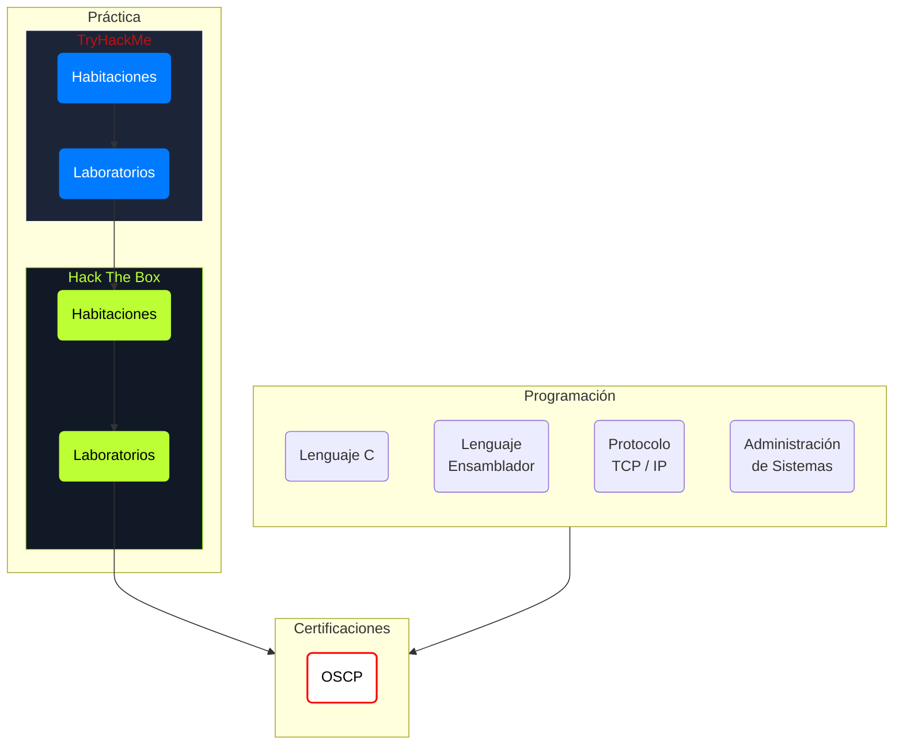

# Según [[David Santo Orcero]]
![[David Santo Orcero#^65743a]]

Libros y recursos online recomendados buscando [[TCP Internals]]:
- [[TCP-IP Illustrated V1 The Protocols|TCP/IP Illustrated, Volume 1: The Protocols]] (EL libro para aprender sobre [[TCP]]).
- [[Unix Network Programming V1 The Sockets Networking API|Unix Network Programming, Volume 1: The Sockets Networking API]] (biblia de [[networking]] con [[C]]).
- [Beej's Guide to Network Programming](http://beej.us/guide/bgnet/).

![[David Santo Orcero#^c13614]]
![[David Santo Orcero#^1e608d]]

# Calidad en Tiempo
## Planteamiento
> [!TIP] Medir la calidad no en cantidad, sino en *tiempo invertido*.

Idea extraída de este [vídeo](https://youtu.be/hDSo-dGs-Z0?t=891) donde *S4vitar* cuenta cómo ha invertido unas **35.000 horas** (aprox) en la ciberseguridad, desde hace **7 años** que se inició (es decir, **15 horas diarias**).

## Mi progreso
> [!IMPORTANT] Momento en el que empecé de verdad a concentrarme en la Ciberseguridad
> Asisto a la primera jornada del [[Jornada I|I Congreso de Ciberseguridad de Andalucía]].
> - **23-03-2022**

1. **Curso de Desarrollo de Malware con Metasploit** | 29-04-2022 -> 13-05-2022 | 25 horas.
2. **Curso de Pentesting con Kali** |  01-01-2022 -> 10-06-2022 | 25 horas.

# Mi RoadMap

