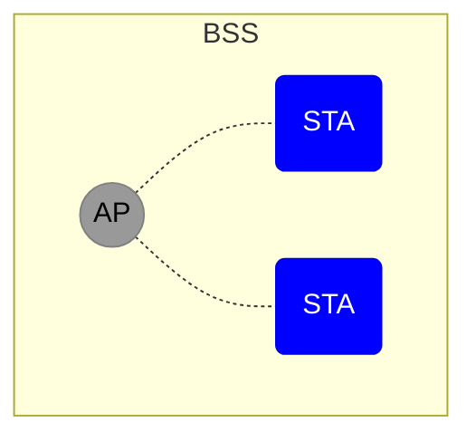
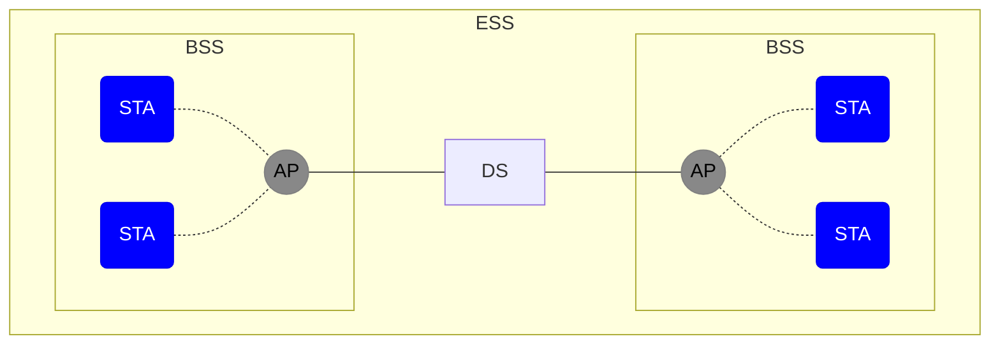
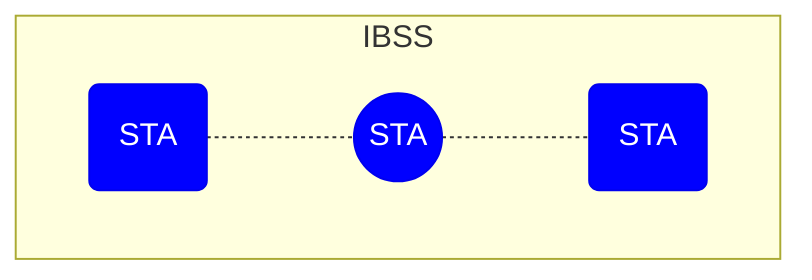
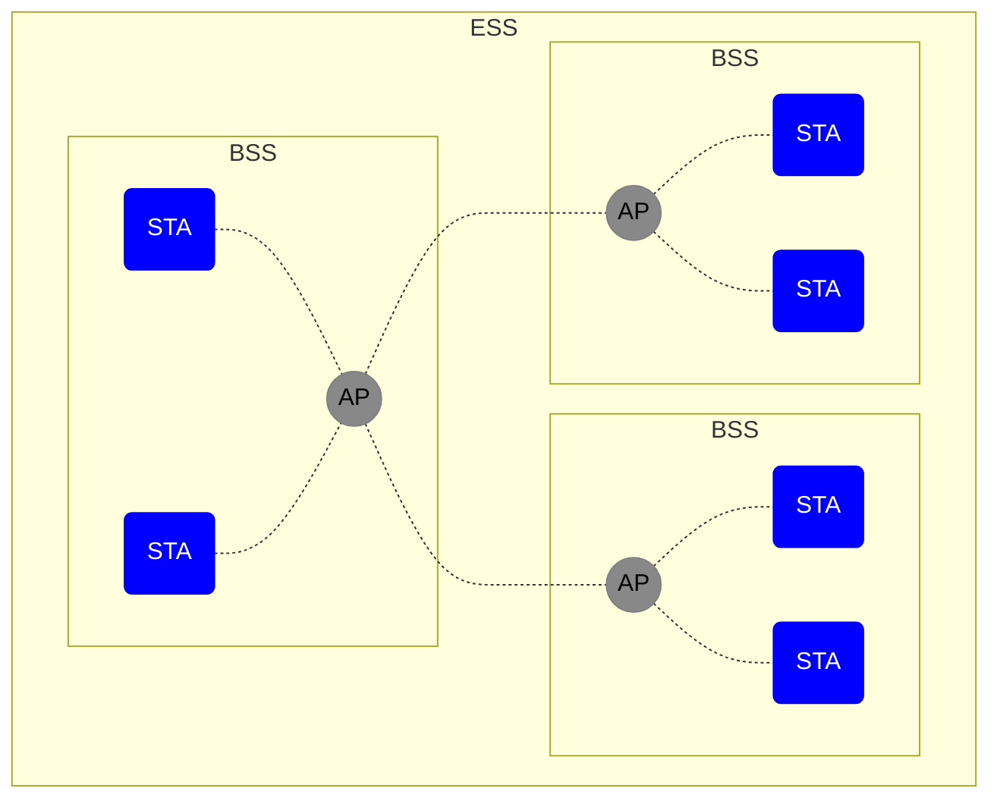

# Introducción

La segunda versión de *[[WPA2|Wi-Fi Protected Access]]*, también conocida como [[WPA2]] se trata de uno de los protocolos de seguridad más utilizados en el mundo. Cuando este acontecimiento se combina con el hecho de que los responsables de seguridad [[IT]] consideran las redes inalámbricas corporativas como el punto débil de las organizaciones, resulta importante **conocer y dominar el ámbito inalámbrico** para poder aplicar las medidas de seguridad más robustas y restrictivas posibles.

Este libro pretende proporcionar **las bases del hacking de redes inalámbricas**, con una primera parte teórica detallada y una segunda parte práctica de técnicas variadas.

# Capítulo 1: El [[IEEE]]
![[IEEE#^762c96]]
El [[IEEE]] se encuentra seleccionado en comités; el comité **802** se encarga de desarrollar y mantener los estándares relacionados con [[LAN]] y [[MAN]]. Su estándares más conocidos son:
- [[Ethernet]]
- [[Bridging and Virtual Bridged LANs]]
- [[WLAN]]
- [[WPAN]]
- [[WMAN]]
- [[WRAN]]
- [[Wireless Coexistence]]
- [[Media Independent Handover Services]]

| Nombre     | Descripción                                                          | Estado        |
|:---------- |:-------------------------------------------------------------------- |:------------- |
| 802.1      | *Higher Layer [[LAN]] Protocols Working Group*                       | 🟢 Activo     |
| 802.2      | *[[LLC]]*                                                            | 🔴 Disuelto   |
| 802.3      | *[[Ethernet]]*                                                       | 🟢 Activo     |
| 802.4      | *Token bus*                                                          | 🔴 Disuelto   |
| 802.5      | *Token ring MAC layer*                                               | 🔴 Disuelto   |
| 802.6      | *[[MAN\|MANs]] (DQDB)*                                               | 🔴 Disuelto   |
| 802.7      | *Broadband [[LAN]] using Coaxial Cable*                              | 🔴 Disuelto   |
| 802.8      | *Fiber Optic [[TAG]]*                                                | 🔴 Disuelto   |
| 802.9      | *Integrated Services [[LAN]] ([[ISLAN]] or [[isoEthernet]])*         | 🔴 Disuelto   |
| 802.10     | *Interoperable [[LAN]] Security*                                     | 🔴 Disuelto   |
| **802.11** | ***[[WLAN]] ([[WLAN]]), [[Mesh]] (Wi-Fi certification)***            | **🟢 Activo** |
| 802.12     | *[[100BaseVG]]*                                                      | 🔴 Disuelto   |
| 802.13     | Sin usar                                                             | ⚪ Reservado  |
| 802.14     | *Cable modems*                                                       | 🔴 Disuelto   |
|            |                                                                      |               |
| 802.15     | *[[WPAN]]*                                                           | 🟢 Activo     |
| 802.15.1   | *[[Bluetooth]] certification*                                        | 🔴 Disuelto   |
| 802.15.2   | Coexistencia del IEEE 802.15 y el IEEE 802.11                        | 🟡 Hibernando |
| 802.15.3   | *High-Rate [[WPAN]] (e.g: [[UWB]]...)*                               |               |
| 802.15.4   | *Low-Rate [[WPAN]] (e.g: [[ZigBee]], [[WirelessHART]], [[MiWi]]...)* | 🟢 Activo     |
| 802.15.5   | *[[Mesh\|Mesh networking]] for [[WPAN]]*                             |               |
| 802.15.6   | *[[Body area network]]*                                              | 🟢 Activo     |
| 802.15.7   | *Visible light communications*                                       |               |
|            |                                                                      |               |
| 802.16     | *Broadband Wireless Access ([[WiMAX]] certification)*                | 🟡 Hibernando |
| 802.16.1   | *Local Multipoint Distribution Service*                              | 🟡 Hibernando |
| 802.16.2   | *Coexistence wireless access*                                        | 🟡 Hibernando |
|            |                                                                      |               |
| 802.17     | *Resilient packet ring*                                              | 🔴 Disuelto   |
| 802.18     | *Radio Regulatory [[TAG]]*                                           |               |
| 802.19     | *Wireless Coexistence Working Group*                                 |               |
| 802.20     | *Mobile Broadband Wireless Access*                                   | 🔴 Disuelto   |
| 802.21     | *Media Independent Handoff*                                          | 🟡 Hibernando |
| 802.22     | *[[WRAN]]*                                                           | 🟡 Hibernando |
| 802.23     | *Emergency Services Working Group*                                   | 🔴 Disuelto   |
| 802.24     | *Vertical Applications [[TAG]]*                                      |               |

## IEEE 802.11 - [[WLAN]]
Este grupo de trabajo ha desarrollado un conjunto de estándares que quedan agrupados bajo el mismo nombre de **[[IEEE]] 802.11**.

> [!INFO] Representación esquemática
> - **IEEE**: asociación internacional.
> - **802**: comité de la asociación.
> - **11**: grupo de trabajo del comité.
> - **b**: estándar desarrollado por el grupo de trabajo.

A continuación, se listan los estándares mencionados anteriormente:

| Grupo de Trabajo | Descripción                                                                                                  | Fecha                |
|:---------------- |:------------------------------------------------------------------------------------------------------------ | -------------------- |
| 802.11-1997      | *Original [[WLAN]] Standard*                                                                                 | 1997                 |
| 802.11a          | *54 Mbit/s, 5 GHz standard*                                                                                  | 1999, envíos en 2001 |
| 802.11b          | *Enhancements to 802.11 to support 5.5 Mbit/s and 11 Mbit/s*                                                 | 1999                 |
| 802.11c          | *Bridge operation procedures; included in the 802.1D standard*                                               | 2001                 |
| 802.11d          | *International (conuntry-to-country) roaming extensions*                                                     | 2001                 |
| 802.11e          | *Enhancements: [[QoS]], including packet bursting*                                                           | 2005                 |
| 802.11F          | *Inter-Access Point Protocol*                                                                                | 2003                 |
| 802.11g          | *54 Mbit/s, 2.4 GHz standard (backwards compatible with b)*                                                  | 2003                 |
| 802.11h          | *Spectrum Managed 802.11a (5 GHz) for 🇪🇺 compatibility*                                                      | 2004                 |
| 802.11i          | *Enhanced security*                                                                                          | 2004                 |
| 802.11j          | *Extensions for 🇯🇵*                                                                                          | 2004                 |
|                  |                                                                                                              |                      |
| 802.11-2007      | *A new release of the standard that includes amendments $a$, $b$, $d$, $e$, $g$, $h$, $i$, and $j$*          | 2007                 |
| 802.11k          | *Radio resource measurement enhancements*                                                                    | 2008                 |
| 802.11n          | *Higher-throughput improvements using [[MIMO]] with antennas*                                                | 2009, septiembre     |
| 802.11p          | *[[WAVE]]: Wireless Access for the Vehicular Environment (such as 🚑 and 🚙)*                                | 2010, julio          |
| 802.11r          | *Fast [[BSS]] transmision ([[FT]])*                                                                          | 2008                 |
| 802.11s          | *[[Mesh\|Mesh Networking]], Extended Service Set ([[ESS]])*                                                  | 2011, julio          |
| 802.11T          | *Wireless Performance Prediction ([[WPP]])*                                                                  |                      |
| 802.11u          | *Improvements related to [[HotSpot\|HotSpots]] and 3rd-party authorization of clients*                       | 2011, febrero        |
| 802.11v          | *Wireless network management*                                                                                | 2011, febrero        |
| 802.11w          | *Protected Management Frames*                                                                                | 2009, septiembre     |
| 802.11y          | *3650 - 3700 MHz Operation in 🇺🇸*                                                                            | 2008                 |
| 802.11z          | *Extensions to Direct Link Setup ([[DLS]])*                                                                  | 2010, septiembre     |
|                  |                                                                                                              |                      |
| 802.11-2012      | *A new release of the standard that includes amendments $k$, $n$, $p$, $r$, $s$, $u$, $v$, $w$, $y$ and $z$* | 2012, marzo          |
| 802.11aa         | *Robust streaming of Audio Video Transport Streams*                                                          | 2012, junio          |
| 802.11ac         | *Very High Throughput < 6 GHz*                                                                               | 2013, diciembre      |
| 802.11ad         | *Very High Throughput 60 GHz*                                                                                | 2012, diciembre      |
| 802.11ae         | *Priorization of Management Frames*                                                                          | 2012, marzo          |
| 802.11af         | *TV Whitespace*                                                                                              | 2014, febrero        |
|                  |                                                                                                              |                      |
| 802.11-2016      | *A new release of the standard that includes amendments $ae$, $aa$, $ad$, $ac$ and $af$*                     | 2016, diciembre      |
| 802.11ah         | *Sub- 1 GHz license exempt operation*                                                                        | 2016, diciembre      |
| 802.11ai         | *Fast Initial Link Setup*                                                                                    | 2016, diciembre      |
| 802.11aj         | *China Millimeter Wave*                                                                                      | 2018, febrero        |
| 802.11ak         | *General Link*                                                                                               | 2018, junio          |
| 802.11aq         | *Pre-assotiation Discovery*                                                                                  | 2018, julio          |
| 802.11ax         | *High Efficiency [[WLAN]]*                                                                                   | En proceso..         |
| 802.11ay         | *Enhancements for Ultra High Throughput in around the 60 GHz Band*                                           | En proceso...        |
| 802.11az         | *Next Generation Positioning*                                                                                | En proceso...        |
| 802.11ba         | *Wake Up Radio*                                                                                              | En proceso...        |
| 802.11bb         | *Light Communications*                                                                                       | En proceso...        |
| 802.11bc         | *Enhanced [[Broadcast]] Service*                                                                             | En proceso...        |
| 802.11bd         | *Enhancements for Next Generation V2X*                                                                       | En proceso...        |
| 802.11be         | *Extremely High Throughput*                                                                                  | En proceso...        |
| 802.11md         | *A new release of the standard that includes previous amendments*                                            | En proceso...        |

> [!INFO] Apreciación de las redes inalámbricas que pueden trabajar a diferentes frecuencias
> **2.4 GHz**: a través de ***802.11b***/*g*/***n***.
> **3.6 GHz**: a través de *802.11y*.
> **4.9 GHz**: a través de ***802.11a***/*h*/*j*/***n***/*ac*.
> **5.9 GHz**: a través de *802.11p*.
> **60 GHz**: a través de *802.11ad*.

La mayoría de estándares ilustrados han satisfecho las distintas necesidades que han surgido a lo largo del tiempo en el ámbito inalámbrico; no obstante, **algunos han tenido más importancia que otros**.

Aquí se reflejan las características principales, de los principales estándares mencionados:

| Estándar | Lanzamiento | Frecuencias (GHz)                         | Ratios (Mbit)                          | Modulación             | Ancho de Banda (MHz) |
| -------- | ----------- | ----------------------------------------- | -------------------------------------- | ---------------------- | ------------------------- |
| Legacy   | 1997        | 2.4-2.5                                   | 1, 2                                   | [[FHSS]] [[DSSS]] | 1, 20                     |
| 802.11b  | 1999        | 2.4-2.5                                   | 1, 2, 5.5, 11                          | [[DSSS]]               | 22                        |
| 802.11a  | 1999        | 5.15-5.25 5.25-5.35 5.725-5.875 | 6, 9, 12, 18, 24, 36, 48, 54 | [[OFDM]]               | 20                        |
| 802.11g  | 2003        | 2.4-2.5                                   | 11a $\cup$ 11b                         | [[DSSS]] [[OFDM]] | 20, 22                    |
| 802.11n  | 2009        | 2.4 5                                | Hasta 600                              | [[DSSS]] [[OFDM]] | 20/20, 40                 |

> [!INFO] [Documentación oficial](https://standars.ieee.org/standar/802_11-2016.html) del estándar *802.11* en su última versión.

### IEEE 802.11 legacy
**La versión original del estándar IEEE 802.11** que especifica 2 velocidades: 1 o 2 Mbit/s, transmitidos a través de señales infrarrojas (IR). Actualmente IR sigue siendo parte del estándar, pero como no existen implementaciones disponibles, se trata de una **versión obsoleta**.

Este estándar en su forma original **define el protocolo [[CSMA-CA|CMSA/CA]] como método de acceso al medio**, lo que provocaba que gran parte de la velocidad de transmisión se consumiera en algunas necesidades de su codificación, como la mejora de la calidad de su calidad (evitando colisiones). Debilidades como esta fueron corregidas con el estándar 802.11b, el primero de esta familia en obtener una amplia aceptación entre sus consumidores.

### IEEE 802.11b
Provee velocidades de hasta 11 Mbit/s en un ratio de frecuencia de 2,4 GHz hasta 2.485 GHz, que se encuentra **subdividido en 14 canales superpuestos**: cada uno utiliza un ratio de 22 MHz sobre su frecuencia central.

| Canal | Frecuencia central (GHz) | Ancho de Banda (MHz) | Canales superpuestos | Regiones * |
|:-----:|:-----------------------------:|:-------------------------:|:-------------------------:| ----------:|
|   1   |             2.412             |       2.401 - 2.423       |            2-5            |     🇺🇸🇪🇺🇯🇵 |
|   2   |             2.417             |       2.406 - 2.428       |          1, 3-6           |     🇺🇸🇪🇺🇯🇵 |
|   3   |             2.422             |       2.411 - 2.33        |         1-2, 4-7          |     🇺🇸🇪🇺🇯🇵 |
|   4   |             2.427             |       2.416 - 2.438       |         1-3, 5-8          |     🇺🇸🇪🇺🇯🇵 |
|   5   |             2.432             |       2.421 - 2.443       |         1-4, 6-9          |     🇺🇸🇪🇺🇯🇵 |
|   6   |             2.437             |       2.426 - 2.448       |         2-5, 7-10         |     🇺🇸🇪🇺🇯🇵 |
|   7   |             2.442             |       2.431 - 2.453       |         3-6, 8-11         |     🇺🇸🇪🇺🇯🇵 |
|   8   |             2.447             |       2.436 - 2.458       |         4-7, 9-12         |     🇺🇸🇪🇺🇯🇵 |
|   9   |             2.452             |       2.441 - 2.463       |        5-8, 10-13         |     🇺🇸🇪🇺🇯🇵 |
|  10   |             2.457             |       2.446 - 2.468       |        6-9, 11-13         |     🇺🇸🇪🇺🇯🇵 |
|  11   |             2.462             |       2.451 - 2.473       |        7-10, 12-13        |     🇺🇸🇪🇺🇯🇵 |
|  12   |             2.467             |       2.456 - 2.478       |        8-11, 13-14        |       🇪🇺🇯🇵 |
|  13   |             2.472             |       2.461 - 2.483       |         9-12, 14          |       🇪🇺🇯🇵 |
|  14   |             2.477             |       2.473 - 2.495       |           12-13           |         🇯🇵 |

\* La disponibilidad de los diferentes canales es dictada por cada país o región.

![[2.4_GHz_Wi-Fi_channels_(802.11b,g_WLAN).png]]

> [!INFO] Tomando 🇪🇺 como referencia
> Con 2.4 GHz como banda de frecuencia, los 13 canales definidos en el estándar y permitidos en Europa, no son completamente independientes: un canal se superpone y produce interferencias hasta en 4 canales distantes.
> 
> **El ancho de banda es superior a la separación entre canales consecutivos y es por eso que es necesaria una separación de al menos 5 canales para evitar interferencias entre celdas adyascentes.**
> 
> En este sentido, normalmente se emplean los **canales 1, 6 y 11 para obtener la mayor productividad posible**, aunque se ha documentado que el uso de los canales 1, 5, 9 y 13 no es perjudicial para la red (esos son los canales usados en 🇪🇸).

![[NonOverlappingChannels2.4GHzWLAN.png]]

Por último, aunque la velocidad máxima de transmisión sea de 11 Mbit/s, debido a que también usa el método de acceso definido para [[CSMA-CA|CSMA/CA]], el espacio ocupado por la codificación de este protocolo provoca que en la práctica, la velocidad máxima de transmisión sea:
- **5.9 Mbit/s sobre [[TCP]]**.
- **7.1 Mbit/s sobre [[UDP]]**.

### IEEE 802.11a
Se desarrolló al mismo tiempo que *802.11*, pero debido a la falta de [[Hardware|hardware]] y su elevado precio en aquel tiempo, no tuvo mucho éxito.

Al usar una frecuencia de 5 GHz, presentaba 2 mejoras sobre *802.11*:
- **La frecuencia de 2.4 GHz** se emplea en múltiples dispositivos (móviles, microondas, dispositivos [[Bluetooth|bluetooth]]...), por lo que hay un gran volumen de interferencias en el medio.
- **La banda de frecuencia de 5 GHz** dispone de más canales disponibles y no superpuestos.

### IEEE 802.11n
Última versión completada en 2009. Incrementa la velocidad de transmisión proporcionada hasta 600 Mbit/s usando **tecnologías de comunicación [[MIMO]] (*Multiple-Input Multiple-Output*)** con antenas que poseen sus propios transmisor y receptor, explotando el fenómeno de *ondas de radio múltiples* (la señal rebota en todos los objetos como paredes, puertas...).

Este estándar permite el uso de **hasta 4 antenas** y esto produce un incremento de *streams* que envían y reciben y, por tanto, una mejor tasa de transferencia. Además, sus canales pueden operar en **un ratio de 40 MHz en lugar de 20 MHz**, doblando el ratio de transferencia.

# Capítulo 2: Arquitecturas Inalámbricas
## Conceptos básicos
> [!INFO] Leyenda
> - **[[Punto de Acceso|AP]]**: punto de acceso (*Access Point*).
> - **STA**: máquina que accede (*STAtion*).
> - **---**: conexión por cable.
> - **- - -**: conexión inalámbrica.

## Modos de operación inalámbricos

### Modo infraestructura

### Modo Ad-Hoc

### Modo *Wireless Distribution System*

## Resumen de conceptos