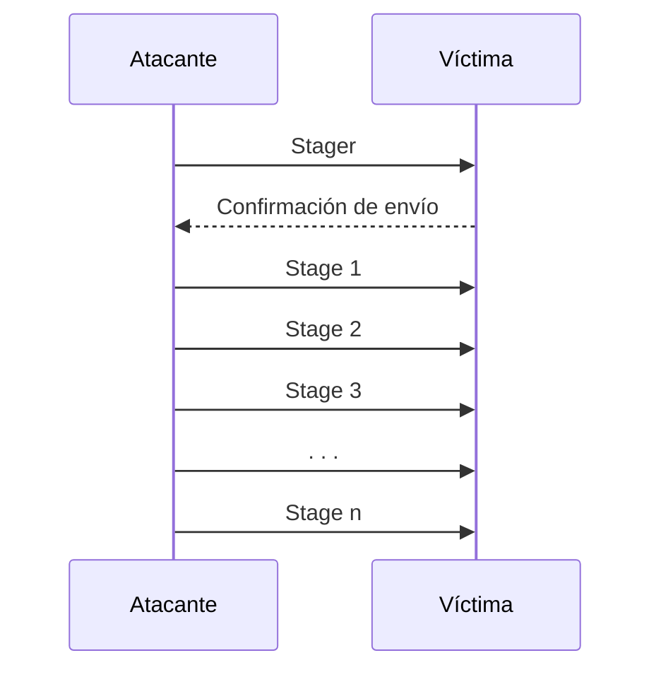

#herramienta 

---

# Introducción
> [!INFO] Definición
> Conjunto de programas (*suite*) que incluye una [[Base de Datos]] de [[Exploit|Exploits]] y de [[Payload|Payloads]] que pueden utilizarse como **pruebas de concepto en [[Pentesting]]**.

^74f91a

 
 *-> Algunos [[Payload|Payloads]] como [[Meterpreter]] son muy complejos.*

Existen aplicaciones (por ejemplo, [[Armitage]]) que se integran con [[Metasploit]] y funcionan como [[GUI]] de [[msfconsole]].

## Características
> [!TIP] [[Metasploit]] está pensado para construir [[Malware]] **combinando módulos**
> Los módulos que vienen de serie en [[Metasploit]] suelen ser suficientes para hacer [[Pentesting]], pero también pueden adquirirse otros módulos más potentes:
> - Gratuitamente.
> - Comprándolos (en la [[Dark Web]] o la [[Deep Web]]).
> 	- Estos son los módulos empleados en [[Ataque informático|Ataques informáticos]].
^d85a5e

# Herramientas que componen el framework
## Básicas
- [[msfconsole]] -> consola de línea de comandos para ejecutar módulos y órdenes.
- [[msfgui]] -> interfaz gráfica con funcionalidades equivalentes a [[msfconsole]].
- [[msfd]] -> [[Daemon]] que permite lanzar las órdenes desde una máquina remota.
- [[msfcli]] -> utilidad para lanzar módulos.
- [[msfupdate]] -> actualiza la [[Base de Datos]] de [[Exploit]], los módulos y las funcionalidades.

## Auditoría dentro de ejecutables
- [[msfbinscan]] -> búsqueda de instrucciones de salto y sobre la pila.
- [[msfpayload]] -> generación de [[Shellcode]] en varios lenguajes de programación o empotrados en ejecutables de [[Unix]] o [[Windows]].
- [[msfencode]] -> ofuscar el código del [[Shellcode]] frente a antivirus y sistemas [[IDS]].
- [[msfvenom]] -> implementa la funcionalidades comentadas en [[msfpayload]] y [[msfencode]].
- [[msfspescan]] -> análisis de las [[DLL]] y generación de direcciones de retorno para las [[Shellcode]].

# Estructura de un [[Malware]]
Los siguientes apartados corresponden a **módulos**.

## Exploit
> [!INFO] Utiliza una vulnerabilidad para ejecutar un [[Payload]]
> Corresponden a vulnerabilidades concretas, de sistemas concretos.
> - Cada vulnerabilidad tiene su propio módulo (de ahí la importancia del [[Reconocimiento|RECON]]).

> [!TIP] Lo normal es intentar adquirir un [[0-day]] en la [[Dark Web]] para el objetivo
> Si no puede obtenerse, el atacante desarrolla el [[Payload]] a medida o modifica uno existente, permitiéndole personalizar el proceso de ataque (automatizarlo, acelerarlo o hacer más difícil el rastreo) respecto a la configuración de la víctima.
^206707

[[Metasploit]] tiene miles incluidos de serie.

## Payload
> [!INFO] Contiene el código que se ejecutará en remoto una vez aplicado el [[Exploit]]
> Estos módulos son muy variados, algunas de las funciones más comunes son:
> - [[Shell remoto]]
> - [[Meterpreter]]
> - [[Pivoting]]
> - [[Escalado de privilegios]]

[[Metasploit]] tiene unos 600 módulos.

### Tipos
#### Inline / Single
El [[Exploit]] contiene: **todo el [[Payload]] + [[Shellcode]]**.
- Más estables.
- Algunos [[Exploit|Exploits]] no soportan el tamaño de algunos [[Payload|Payloads]].
- Son más difíciles de esconder frente a un [[IDS]] o un [[AV]].

#### Stager
El [[Exploit]] contiene: **una parte del [[Payload]], el mecanismo de conexión**.
- Realiza descargas a la máquina del atacante desde la máquina infectada.
- Puede usar `if` e  `if-else` para descargar *stages* de forma condicionada.

##### Stage
Cada una de las etapas que descarga y ejecuta un *stager*.
- No incluírlo en el [[Exploit]] inicial permite que sean arbitrariamente grandes y complejos.
- Permite usar técnicas de [[Enmascaramiento]] avanzadas para evitar a los [[IDS]] y [[AV]].

> [!EXAMPLE] Ejemplo de explotación de una vulnerabilidad de un [[Windows]] para abrir un [[Shell remoto]]
> Inline/Single: `windows/shell_bind_tcp`.
> 1. El [[Exploit]] accede a la máquina y ejecuta el [[Payload]] que produce el [[Shell remoto]].
> 
> Stager: `windows/shell/bind_tcp`.
> 1. El [[Exploit]] accede a la máquina.
> 2. Utiliza `bind_tcp` como *stager*, generando una conexión [[TCP]].
> 3. El *stager* descarga el módulo `shell` como *stage* desde el atacante.
> 4. El *stager* ejecuta el *stage*, produciendo el [[Shell remoto]].

#### Middle stager
El [[Exploit]] contiene: **nada, no permite contener el [[Payload]] ni descargar un *stager* completo**.
Consiste en un sistema de descarga extremadamente pequeño y simple que sí podrá descargar el *stager* completo.

## Enconder
> [!INFO] Ofusca el [[Shellcode]] para esconder el ataque de los [[IDSs]] y [[AV|AVs]]

[[Metasploit]] tiene menos de 100.

## Evasion
> [!INFO] Esconde el [[Malware]] del [[AV]]
> Hacen mucho más que una simple ocultación.

[[Metasploit]] tiene menos de 12 (a día de hoy, todos son de [[Windows]]).

## Nop
> [!INFO] No hacen nada
> Se utilizan para posicionar el [[Shellcode]] de una forma muy concreta.
> Se trata de un módulo muy avanzado.
>- Se usa poco en [[Pentesting]].
>- Se usa mucho en [[Ataque informático|Ataques]].

[[Metasploit]] tiene uno por cada procesador objetivo.

## Post
> [!INFO] Avanzar en el ataque en un sistema ya comprometido para recopilar informació
> Sus funcionalidades incluyen:
> - [[Pivoting]]
> - [[Keylogging]]
> - Obtener credenciales, claves...
> - (...)

> [!TIP] Corresponden con la [[Exfiltración|Fase de Exfiltración]] de un [[Ataque informático]].

[[Metasploit]] tiene más de medio millar de serie.
- Lo normal es que en un [[ataque]] se programe un módulo adaptado al sistema objetivo.

## Auxiliary
> [!INFO] Cualquier módulo que no entre en ninguna de las categorías anteriores.

[[Metasploit]] tiene más de 2000 de serie.
- Algunos pueden ejecutar herramientas de [[Kali Linux]].
