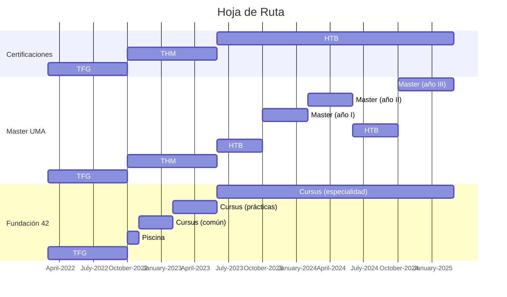

# Mis planes de estudio
Lo más importante en la ciberseguridad son las **certificaciones** especializadas.
- **Un título por sí solo no sirve de nada**, solo demuestra que una persona ha pasado por unos estudios superiores en una universidad.
- **Una certificación es una demostración inequívoca** de que una persona posee unos conocimientos avanzados en un determinado área de la ciberseguridad.

Por eso, sea cual sea la ruta que acabe haciendo, **mi objetivo final es acabar con conocimientos para las certificaciones**. Un conocimiento que no voy a ganar en la universidad, sino por mi cuenta.

## Plan original
Obtener un **[máster](https://www.uma.es/master-en-ingenieria-informatica/)** en el curso 2023-2024, tomándome previamente un **año sabático** para aprender ciberseguridad en las plataformas:
1. **[[TryHackMe]]** -> Muy teórica, para aprender los conceptos y reforzar las bases.
2. **[[Hack The Box]]** -> Muy práctica, para poner a prueba lo aprendido con ejercicios.

## Plan alternativo
Acceder a la formación ofertada por la **[Fundación 42](https://www.42malaga.com/)**, que ofrece, gratuitamente:
- Formación básica en programación de HTML, JavaScript, CSS y **lenguaje C**.
- Experiencia con empresa poco después del inicio formal del curso.
- Formación especializada en ramas de ciberseguridad.

*Por otra parte, como este plan requiere empezar antes, la principal ventaja que tiene es que siempre **podría intentarlo de nuevo el año siguiente o bien, volver al plan original** (ambos casos sucederían en 2023).*

## Hojas de Ruta

# Comparación
## Ventajas
1. **Enseñanza P2P**
	No hay profesores, los alumnos aprenden por su cuenta y se ayudan entre ellos.
2. **Campus abierto 24/7**
	No hay horario, solo proyectos: los alumnos deciden cuánto tiempo dedicarles.
3. **Prácticas en empresa**
	Las empresas están muy relacionadas con el sector digital.
4. **Formación previa (intensiva) en programación**
	Aprendizaje intensivo de HTML, JavaScript y CSS (programación web) previo al *cursus*.
5. **Gratuita**
	No hay que pagar nada antes, ni durante, ni al terminar la formación completa.

## Desventajas
1. **La formación completa (*cursus*) dura 2.5 años**
	Un año más que la duración media de un máster universitario.
2. **Al finalizar no se recibe un certificado oficial**
	Un máster universitario te otorga el título de ingeniero.

# Resumen
## General
|          |     Máster de la UMA     |           Fundación 42            |
|:--------:|:------------------------:|:---------------------------------:|
|  Precio  |          1200 €          |              **0 €**              |
| Duración |       **1.5 años**       |             2.5 años              |
| Diploma  | **Máster Universitario** | Certificado de finalización [1,2] |

## Contenido
|                       |              Máster de la UMA               |              Fundación 42              |
|:---------------------:|:-------------------------------------------:|:--------------------------------------:|
| Prácticas en Empresas |            Optativas (13.5 CDT)             |            **Obligatorias**            |
|       Contenido       | Mayormente teórico y probablemente estático | **Mayormente práctico y dinámico** [3] |
|      Evaluación       |            Prácticas y exámenes             |      **Elaboración de proyectos**      |

## Aclaraciones
 [1] Al no ser una formación reglada, no puede emitir diplomas "oficiales", pero el certificado de finalización indica el nivel de conocimientos alcanzado por el alumno.
 
 [2] Al finalizar el curso, el alumno puede hacer público todo su trabajo y calificaciones, permitiendo que las empresas vean directamente sus aptitudes y competencias.
 
 [3] El contenido se actualiza y se ajusta a las necesidades del sector, ya que se busca formar a profesionales que hagan frente a la alta demanda de puestos.
